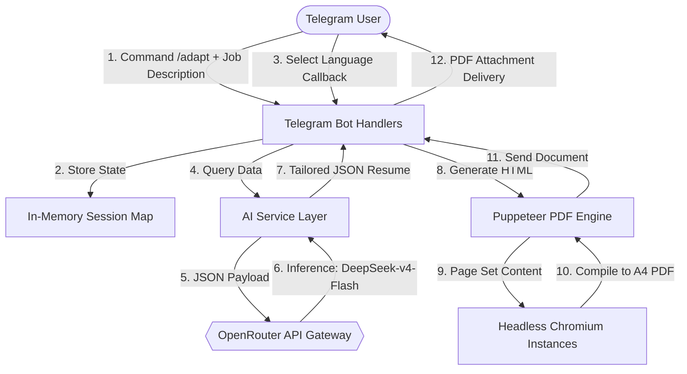

# Engineering an Automated, Real-Time Resume Optimizer Bot: System Architecture and AI Model Trade-Offs

**Author:** Renan Costa  
**Academic Context:** Computer Engineering Student Project  
**License:** MIT

---

## Abstract
Modern recruitment processes are heavily gatekept by Applicant Tracking Systems (ATS), which filter candidates based on algorithmic keyword matching and semantic alignment with job descriptions. To bypass this barrier without compromising truthfulness, this project implements a real-time, event-driven Telegram Bot that ingests job postings, dynamically aligns a candidate's master resume utilizing Large Language Models (LLMs), and outputs a formatted, print-ready PDF using a headless web browser rendering engine. This document details the system architecture, separation of concerns, and the quantitative reasoning behind the AI model selection under a student budget.

---

## 1. Introduction & The Engineering Challenge
As computer engineering students approaching the job market, we face a dual problem:
1. **The ATS Filter:** Resumes must be customized for every application to highlight relevant experiences, or they get filtered out by automated parsers.
2. **The Customization Overhead:** Manually tailoring resumes is a time-consuming task prone to semantic errors and formatting issues.

The goal of this project is to automate this customization pipeline. We treat a resume as a **structured JSON document** (the data layer), the job description as **unstructured text** (the query layer), and the output PDF as a compiled view (the presentation layer). By separating these layers, we create a reproducible, modular compiler that performs semantic translation via AI and layout compilation via Puppeteer.

---

## 2. High-Level System Architecture
The system follows a decoupled, modular pipeline. It is built in **TypeScript** and runs on **Node.js** utilizing an asynchronous, event-driven architecture. 

Below is the conceptual flow of the system:

### 2.1 The Separation of Concerns
Following design patterns in software architecture, we separated the monolithic Telegram script into distinct modules under the `src/` directory:

1. **Configurations (`src/config.ts`):** Handles initialization of API clients (Telegraf bot, OpenRouter OpenAI instance) and reads environment variables.
2. **Service Layer (`src/services/`):**
   - **`ai.ts`:** Interfaces with OpenRouter, manages the system instructions prompt, and enforces JSON output schemas.
   - **`pdf.ts`:** Manages the lifecycle of a global headless Puppeteer browser instance (pooling) to avoid spawning heavy Chrome processes for every incoming message, and compiles dynamic HTML/CSS templates into PDF formats.
3. **Utilities (`src/utils/`):** Contains logic like `skills.ts` which takes raw unstructured tags from the LLM and matches them against pre-defined engineering domains (Languages, Databases, Backend, DevOps).
4. **Presentation/Data Layer (`myResume.json` & `baseResume.json`):** Your personal resume data is kept local in `myResume.json` (gitignored), separating the application code from personal PII (Personally Identifiable Information).

---

## 3. Asynchronous Data Pipeline: How It Works

### Step 1: Ingestion & State Machine
The Telegraf framework listens for `/adapt [job description]` commands. Because Telegram is a stateless interface, we initialize a session context map (`userSessions`) in-memory. The bot records the job description and prompts the user with inline keyboard buttons to choose a language.

### Step 2: Semantic Adaption (LLM Synthesis)
Once the language callback is triggered, the AI Service combines the user's `myResume.json` data and the job description into a structured prompt. The system instructions dictate that the model behaves as an elite recruiter:
- It runs a keyword density analysis on the job description.
- It reformulates bullet achievements using the **STAR Method** (Situation, Task, Action, Result), injecting metrics and strong action verbs (e.g., *Optimized database queries... reducing latency by 50%*).
- It formats the output strictly to a structured JSON matching the original schema.

### Step 3: Layout Compilation (Puppeteer PDF Render)
The JSON returned by the AI is merged with the base contact details (which the LLM doesn't change to prevent hallucinations) and passes to the PDF Service. 
The PDF service compiles an HTML string styled with pure, layout-stable CSS. Spawning a new browser process for every document generation is a CPU and memory bottleneck. To solve this, we implemented a **Singleton connection pool pattern** inside `pdf.ts`:
- A global `puppeteer.Browser` instance is lazily instantiated on demand.
- Spawns lightweight browser pages (`browser.newPage()`) which are closed immediately after PDF compilation to prevent memory leaks.
- Uses `@page` CSS directives to enforce A4 bounds, margin containment, and page-breaking prevention on elements (`page-break-inside: avoid`).

---

## 4. AI Model Selection: Performance vs. Cost Constraints

As computer engineering students, API consumption costs are a primary constraint. Deploying models like OpenAI's `gpt-4o` or Anthropic's `claude-3-5-sonnet` for dynamic resume adaptation can quickly become expensive. Let's analyze the trade-offs.

### 4.1 Quantitative Price Comparison
The application uses **OpenRouter** as an API gateway, allowing us to swap models dynamically by editing a single environment variable. Below is a comparison of input/output token pricing per 1 million tokens for models evaluated for this task (rates as of Q2 2026):

| Model Provider & Name | Input Cost / 1M Tokens | Output Cost / 1M Tokens | Quality for JSON Structuring |
| :--- | :--- | :--- | :--- |
| **OpenAI GPT-4o** | $2.50 | $10.00 | Excellent |
| **Anthropic Claude 3.5 Sonnet** | $3.00 | $15.00 | Exceptional |
| **DeepSeek V3 (Chat)** | $0.14 | $0.28 | Great |
| **DeepSeek v4 Flash** | **$0.07** | **$0.21** | **Excellent (Selected)** |
| **Google Gemini 1.5 Flash** | $0.075 | $0.30 | Good |

### 4.2 Economic Analysis of a Single Execution
Let's estimate the cost of a single adaptation execution:
- **Baseline Resume (Input):** ~2,500 tokens (JSON formatting + prompt parameters).
- **Job Description (Input):** ~1,000 tokens.
- **System Instructions (Input):** ~500 tokens.
- **Total Input Tokens:** ~4,000 tokens.
- **Adapted Resume (Output JSON):** ~1,500 tokens.

#### Case A: Running with OpenAI GPT-4o
$$\text{Input Cost} = 4,000 \times \left(\frac{\$2.50}{1,000,000}\right) = \$0.010$$
$$\text{Output Cost} = 1,500 \times \left(\frac{\$10.00}{1,000,000}\right) = \$0.015$$
$$\textbf{Total Cost per Resume} = \mathbf{\$0.025}$$

#### Case B: Running with DeepSeek-v4-Flash (Our Choice)
$$\text{Input Cost} = 4,000 \times \left(\frac{\$0.07}{1,000,000}\right) = \$0.00028$$
$$\text{Output Cost} = 1,500 \times \left(\frac{\$0.21}{1,000,000}\right) = \$0.000315$$
$$\textbf{Total Cost per Resume} = \mathbf{\$0.000595}$$

#### Architectural Decision
Using **DeepSeek-v4-Flash** yields a price reduction of:
$$\text{Savings} = 1 - \frac{\$0.000595}{\$0.025} \approx \mathbf{97.6\%}$$

For a student optimizing their resume for 100 job listings, GPT-4o costs **$2.50**, while DeepSeek-v4-Flash costs **$0.06**. By leveraging DeepSeek-v4-Flash, we get high-speed JSON structure compliance and top-tier semantic writing quality for a fraction of the price.

---

## 5. Architectural Trade-offs & Engineering Decisions

### 5.1 In-Memory vs. Database State
For simplicity and to keep the bot lightweight and zero-dependency, we selected an in-memory `Map` to hold user sessions. 
- *Trade-off:* If the server restarts, active sessions are lost.
- *Rationale:* Since a user session is transient (it only lasts between pasting a job description and clicking a button, roughly 10 seconds), adding database infrastructure (MongoDB/PostgreSQL) introduces unnecessary latency, deployment cost, and architectural complexity.

### 5.2 HTML-to-PDF vs. Native Canvas Engines
We chose Puppeteer (HTML/CSS compilation) over native PDF generation libraries (like PDFKit).
- *Trade-off:* Puppeteer downloads a Chromium binary, increasing the disk footprint of the deployment container (~150MB).
- *Rationale:* Native PDF engines require manual placement of text using coordinates, making wrap-around lists and complex state-based CSS (like page breaking and column margins) extremely tedious to maintain. HTML/CSS templating allows us to iterate on styling and layouts instantly.

---

## 6. Conclusion
By applying core software engineering practices—Separation of Concerns, Singleton Connections, and strict Interface Typing—we successfully built a production-grade automated compiler. The cost optimization logic highlights that choosing lightweight inference servers like DeepSeek via OpenRouter provides student developers with enterprise-level capabilities while keeping operations sustainable.
