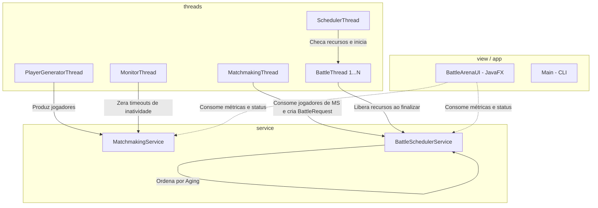

# 📝 Construindo o Battle Arena: Como Unimos Programação Concorrente, Escalonamento de Processos e POO em um Simulador Robusto

## 📄 Resumo
Este artigo descreve detalhadamente o desenvolvimento do **Battle Arena Manager**, um simulador multithreaded de matchmaking e agendamento de batalhas. O projeto foi projetado para demonstrar a aplicação prática de conceitos de **Sistemas Operacionais (SO)** — como concorrência, exclusão mútua, sincronização cooperativa, escalonamento e gerenciamento de recursos — sob a ótica de engenharia de software com **Programação Orientada a Objetos (POO)** em Java. Discutimos aqui o fluxo arquitetural, a dinâmica concorrente, as principais dificuldades técnicas enfrentadas e os mecanismos de segurança de dados implementados.

---

## 1. Introdução: O Desafio do Matchmaking
Nos jogos online modernos de escala massiva, como *League of Legends*, *Valorant* ou *Counter-Strike*, o sistema de matchmaking (pareamento de partidas) é um dos componentes de infraestrutura mais críticos. Ele precisa lidar com um fluxo ininterrupto de centenas ou milhares de requisições de jogadores por segundo, organizá-los em filas distintas de acordo com seus interesses, criar matches equilibrados e escalonar essas partidas em recursos computacionais limitados (servidores dedicados) — tudo isso sem causar lentidão ou inconsistência de dados.

O **Battle Arena** foi projetado para modelar essa dinâmica. O desafio de engenharia aqui foi simular esse ambiente complexo em uma única máquina, garantindo que o fluxo concorrente de geração de conexões de jogadores, pareamento de duplas, escalonamento e execução gráfica transcorresse de forma paralela e livre de travamentos (*deadlocks*), inanição (*starvation*) ou dados duplicados (*race conditions*).

---

## 2. A Arquitetura do Simulador

O sistema foi estruturado seguindo uma **Arquitetura em Camadas (Layered Architecture)**, visando separar a lógica de apresentação da lógica operacional de concorrência e das entidades de domínio.



Cada pacote possui uma responsabilidade bem definida:
*   **[app](file:///C:/Users/renan/IdeaProjects/Battle-Arena/src/main/java/app)**: Ponto de entrada do console, onde a simulação pode ser comandada via terminal ([Main.java](file:///C:/Users/renan/IdeaProjects/Battle-Arena/src/main/java/app/Main.java)).
*   **[model](file:///C:/Users/renan/IdeaProjects/Battle-Arena/src/main/java/model)**: Contém as estruturas de dados. [Player.java](file:///C:/Users/renan/IdeaProjects/Battle-Arena/src/main/java/model/Player.java) representa o usuário, [QueueRequest.java](file:///C:/Users/renan/IdeaProjects/Battle-Arena/src/main/java/model/QueueRequest.java) rastreia seu tempo de entrada na fila, [BattleRequest.java](file:///C:/Users/renan/IdeaProjects/Battle-Arena/src/main/java/model/BattleRequest.java) é o match pareado, e [Metrics.java](file:///C:/Users/renan/IdeaProjects/Battle-Arena/src/main/java/model/Metrics.java) acumula os dados de performance de forma thread-safe.
*   **[service](file:///C:/Users/renan/IdeaProjects/Battle-Arena/src/main/java/service)**: Lógica principal das filas ([MatchmakingService.java](file:///C:/Users/renan/IdeaProjects/Battle-Arena/src/main/java/service/MatchmakingService.java)) e do gerenciamento e priorização de recursos computacionais ([BattleSchedulerService.java](file:///C:/Users/renan/IdeaProjects/Battle-Arena/src/main/java/service/BattleSchedulerService.java)).
*   **[thread](file:///C:/Users/renan/IdeaProjects/Battle-Arena/src/main/java/thread)**: Todas as lógicas paralelas encapsuladas que rodam de forma concorrente em background.
*   **[view](file:///C:/Users/renan/IdeaProjects/Battle-Arena/src/main/java/view)**: Interface enriquecida em JavaFX ([BattleArenaUI.java](file:///C:/Users/renan/IdeaProjects/Battle-Arena/src/main/java/view/BattleArenaUI.java)) que desenha gráficos de utilização de recursos e atualiza os logs das threads em tempo real.

---

## 3. Conceitos Aplicados de Sistemas Operacionais e Concorrência

A engenharia do simulador baseia-se fortemente em dinâmicas de sistemas operacionais:

### A. Multithreading e Concorrência
O sistema opera através de 5 tipos de threads cooperativas:
1.  **[PlayerGeneratorThread](file:///C:/Users/renan/IdeaProjects/Battle-Arena/src/main/java/thread/PlayerGeneratorThread.java)**: Simula o tráfego de rede gerando novos jogadores aleatórios.
2.  **[MatchmakingThread](file:///C:/Users/renan/IdeaProjects/Battle-Arena/src/main/java/thread/MatchmakingThread.java)**: Monitora ativamente as filas e tenta unir pares disponíveis em combates.
3.  **[SchedulerThread](file:///C:/Users/renan/IdeaProjects/Battle-Arena/src/main/java/thread/SchedulerThread.java)**: Coordena o início das partidas organizadas na fila de prioridades, aguardando recursos de slots ficcionais do servidor.
4.  **[BattleThread](file:///C:/Users/renan/IdeaProjects/Battle-Arena/src/main/java/thread/BattleThread.java)**: Simula a partida rodando em background com duração variável (aleatória baseada no tipo). Ela libera os recursos do servidor ao concluir.
5.  **[MonitorThread](file:///C:/Users/renan/IdeaProjects/Battle-Arena/src/main/java/thread/MonitorThread.java)**: Realiza tarefas de monitoria de integridade do sistema ("Garbage Collector" lógico) a cada 3 segundos.

### B. O Padrão Produtor-Consumidor
Temos uma cadeia de produção-consumo de duas vias:
*   A thread geradora (`PlayerGeneratorThread`) **produz** novos registros de jogadores e os insere nas filas do `MatchmakingService`. O `MatchmakingThread` atua como **consumidora** dessas filas, extraindo e esvaziando-as para criar objetos de `BattleRequest`.
*   O `MatchmakingThread` passa a ser a **produtora** das requisições de batalha para o `BattleSchedulerService`. Por fim, a thread de agendamento (`SchedulerThread`) **consome** essas batalhas prontas, disparando-as quando os recursos do servidor se liberam.

### C. Exclusão Mútua (Mutex) e Thread Safety
Como as filas de jogadores e a lista de batalhas pendentes são lidas e modificadas simultaneamente por diferentes processos paralelos, há um sério risco de **Race Condition (Condição de Corrida)**. Caso dois processos decidissem remover o mesmo jogador da fila ao mesmo tempo, geraria inconsistência na memória.

Para garantir que cada operação crítica nas listas ocorra de forma **Atômica**, implementamos blocos síncronizados (`synchronized`) protegidos por um lock atômico privado em [MatchmakingService.java](file:///C:/Users/renan/IdeaProjects/Battle-Arena/src/main/java/service/MatchmakingService.java):
```java
private final Object lock = new Object();

public void addPlayerToQueue(Player player, BattleType type) {
    synchronized (lock) {
        queues.get(type).add(new QueueRequest(player));
        lock.notifyAll(); // Acorda threads em wait()
    }
}
```
Isso garante a **Exclusão Mútua**: apenas uma thread por vez pode obter a posse do `lock` para ler ou gravar dados nas filas compartilhadas.

### D. Comunicação entre Threads (Evitando Espera Ocupada)
A busca ininterrupta de matches em um laço `while(true)` sem pausa degradaria o processador do computador ao máximo (prática nociva conhecida como *Espera Ocupada / Busy Waiting*). Para mitigar isso, implementamos as chamadas cooperativas do Java:
*   `wait()`: O processamento entra em suspensão quando não há elementos suficientes na fila.
*   `notifyAll()`: A thread geradora acorda todas as threads adormecidas sempre que um novo jogador é adicionado.

### E. Escalonamento por Prioridade Não-Preemptivo com Aging (Envelhecimento)
O agendador do Battle Arena gerencia a alocação de recursos escassos do servidor (capacidade total = 10 slots).
As partidas possuem custos e prioridades distintos em [BattleType.java](file:///C:/Users/renan/IdeaProjects/Battle-Arena/src/main/java/model/BattleType.java):
*   `CASUAL_MATCH`: Custo 1 slot, Prioridade Baixa.
*   `RANKED_MATCH`: Custo 2 slots, Prioridade Média.
*   `TOURNAMENT_MATCH`: Custo 3 slots, Prioridade Alta.

Um escalonador de prioridades simples causaria o problema de **Starvation (Inanição)**: o fluxo constante de torneios de alta prioridade impediria que as partidas casuais de baixa prioridade obtivessem slots do servidor. 
Para resolver isso de forma justa, aplicamos o algoritmo de **Aging (Envelhecimento)** em [BattleRequest.java](file:///C:/Users/renan/IdeaProjects/Battle-Arena/src/main/java/model/BattleRequest.java):
```java
public double calculatePriorityWithAging() {
    long waitSeconds = (System.currentTimeMillis() - creationTime) / 1000;
    // Incrementa a prioridade em 1 unidade a cada 5 segundos de espera
    return this.battleType.getPriority() + (waitSeconds / 5.0);
}
```
Periodicamente, as batalhas pendentes no agendador são reordenadas dinamicamente com base nessa fórmula. Desta forma, uma requisição Casual que espera tempo suficiente eventualmente ultrapassa a prioridade de um Torneio recém-chegado.

O sistema é **Não-preemptivo**, significando que uma vez iniciada, a batalha consome seus recursos computacionais até o fim, sem ser forçada a pausar por requisições de maior prioridade.

---

## 4. Conceitos Práticos de Programação Orientada a Objetos (POO)

A robustez e a manutenção simplificada do Battle Arena derivam de uma aplicação meticulosa dos pilares da orientação a objetos:

*   **Encapsulamento**: Toda a lógica de contagem de métricas agregadas em [Metrics.java](file:///C:/Users/renan/IdeaProjects/Battle-Arena/src/main/java/model/Metrics.java) protege os seus atributos de escrita não autorizada. O contador utiliza modificadores `synchronized` internos para garantir que incrementos vindos de múltiplas threads concorrentes aconteçam com segurança sem corromper as estatísticas.
*   **Abstração**: A interface visual JavaFX não lida com locks, semáforos, ou ordenações de filas. Ela interage apenas com os métodos públicos de alto nível expostos pelos serviços, desacoplando totalmente a apresentação gráfica da engine operacional de concorrência.
*   **Polimorfismo**: A inicialização das threads do sistema ocorre sobre instâncias uniformes da interface `Runnable`. Isso permite que o ciclo de vida concorrente de objetos totalmente distintos (gerador de jogadores, agendador e gerenciador de interface) seja gerenciado de forma consistente pelo framework Java Thread.
*   **Type Safety via Enums**: O uso do enum [BattleType.java](file:///C:/Users/renan/IdeaProjects/Battle-Arena/src/main/java/model/BattleType.java) encapsulou não apenas constantes, mas também inteligência do domínio, armazenando os limites máximos de espera (`maxWaitTime`) e custos de recursos computacionais (`requiredResources`) por categoria de jogo.

---

## 5. Prevenção de Erros e Garantia de Robustez

Durante a concepção de sistemas concorrentes, a depuração é notoriamente difícil devido ao comportamento assíncrono. O projeto utilizou estratégias defensivas para blindar o código contra falhas graves:

1.  **Prevenção de ConcurrentModificationException**:
    *   *O Erro*: Ocorre quando uma thread tenta iterar sobre uma lista (por exemplo, na impressão de relatórios ou verificação de timeout) enquanto outra thread adiciona ou remove elementos dela.
    *   *A Solução*: Todas as coleções que sofrem acessos compartilhados foram encapsuladas dentro de escopos sob sincronização com o mesmo objeto `lock`. Ao iterar nas filas no [MatchmakingService.java](file:///C:/Users/renan/IdeaProjects/Battle-Arena/src/main/java/service/MatchmakingService.java), fazemos isso de forma sincronizada ou criando cópias temporárias instantâneas das coleções antes de expurgá-las.
2.  **Mitigação de Deadlocks (Impasse)**:
    *   *O Erro*: Ocorre quando duas threads ficam bloqueadas para sempre, uma esperando por um recurso que está retido pela outra.
    *   *A Solução*: Adotamos uma política de **Lock Único e Bem Definido**. Em vez de sincronizar as operações com múltiplos locks cruzados (um lock para cada tipo de fila), sincronizamos todos os acessos das listas de matchmaking em torno de um único `lock` privado. Isso evita o cenário onde uma thread segura o Lock A esperando o Lock B, enquanto outra thread segura o Lock B e espera pelo Lock A.
3.  **Tratamento de timeouts concorrentes (Abandono de Fila)**:
    *   *O Erro*: Jogadores que estouraram o tempo limite de espera precisam ser removidos. Contudo, se a limpeza de timeouts ocorresse simultaneamente ao pareamento, dados poderiam ser corrompidos.
    *   *A Solução*: A [MonitorThread.java](file:///C:/Users/renan/IdeaProjects/Battle-Arena/src/main/java/thread/MonitorThread.java) chama o método de remoção que é executado de forma síncrona sob o lock protetor. Caso o jogador já tenha sido pareado no mesmo milissegundo, o sistema detecta que o ticket já foi consumido e cancela o timeout de forma limpa.

---

## 6. Conclusão

O desenvolvimento do **Battle Arena Manager** provou que o gerenciamento de concorrência em sistemas distribuídos e infraestruturas de jogos demanda extremo rigor na sincronização e modelagem.

A fusão de algoritmos clássicos de Sistemas Operacionais, como o **Priority Scheduling com Aging**, associada aos pilares de **Programação Orientada a Objetos**, resultou em uma aplicação resiliente capaz de lidar com picos de tráfego simulados de jogadores, garantindo equidade e justiça no tempo de atendimento de filas, estabilidade no uso dos recursos do servidor e um monitoramento visual claro das interações dinâmicas em tempo real.
